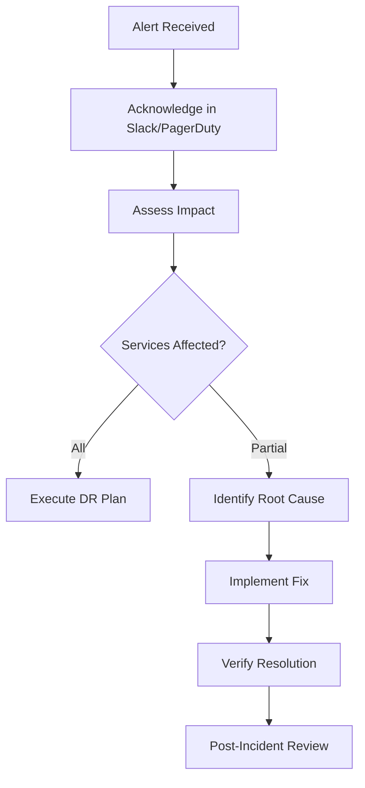

# Operations Runbook

Standard operating procedures for managing the Mosuon Kubernetes cluster (207.180.237.35).

## Table of Contents

1. [Daily Operations](#daily-operations)
2. [Incident Response](#incident-response)
3. [Common Tasks](#common-tasks)
4. [Emergency Procedures](#emergency-procedures)
5. [Maintenance Windows](#maintenance-windows)

## Daily Operations

### Morning Health Check

```bash
#!/bin/bash
# Save as: scripts/daily-health-check.sh

echo "🔍 Mosuon Cluster Health Check - $(date)"
echo "========================================="

# 1. Node status
echo -e "\n📦 Node Status:"
kubectl get nodes -o wide

# 2. Pod health
echo -e "\n🏃 Pod Health (non-Running or Restarts > 5):"
kubectl get pods -A --field-selector=status.phase!=Running,status.phase!=Succeeded
kubectl get pods -A -o json | jq -r '.items[] | select(.status.containerStatuses[]?.restartCount > 5) | "\(.metadata.namespace)/\(.metadata.name) - Restarts: \(.status.containerStatuses[].restartCount)"'

# 3. PVC status
echo -e "\n💾 PersistentVolumeClaims (not Bound):"
kubectl get pvc -A --field-selector=status.phase!=Bound

# 4. Certificate expiry
echo -e "\n🔒 TLS Certificates:"
kubectl get certificate -A -o custom-columns=NAMESPACE:.metadata.namespace,NAME:.metadata.name,READY:.status.conditions[0].status,EXPIRY:.status.notAfter

# 5. ArgoCD app sync status
echo -e "\n🔄 ArgoCD Applications:"
kubectl get applications -n argocd -o custom-columns=NAME:.metadata.name,SYNC:.status.sync.status,HEALTH:.status.health.status

# 6. Resource usage
echo -e "\n📊 Resource Usage:"
kubectl top nodes
kubectl top pods -A --sort-by=memory | head -20

# 7. Recent events (errors/warnings)
echo -e "\n⚠️  Recent Cluster Events:"
kubectl get events -A --sort-by='.lastTimestamp' | grep -E 'Warning|Error' | tail -10

echo -e "\n✅ Health check complete"
```

### Weekly Tasks

**Every Monday**:
- Review resource usage trends
- Check for available updates (ArgoCD, ingress, cert-manager)
- Review and rotate logs if needed
- Verify backups completed successfully

```bash
# Check backup status (if using velero)
kubectl get backups -n velero

# Review Prometheus alerts
kubectl get prometheusrules -A

# Check certificate renewal schedule
kubectl get certificate -A -o json | jq -r '.items[] | "\(.metadata.namespace)/\(.metadata.name): \(.status.notAfter)"'
```

## Incident Response

### Severity Levels

| Severity | Description | Response Time | Examples |
|----------|-------------|---------------|----------|
| **P0** | Critical outage | Immediate | All services down, data loss |
| **P1** | Major degradation | 15 minutes | One app down, database issues |
| **P2** | Minor issues | 1 hour | Performance degradation, non-critical errors |
| **P3** | Cosmetic/enhancement | Next sprint | UI glitches, feature requests |

### P0 Response Procedure



**Steps**:
1. **Acknowledge** (within 5 min)
   ```bash
   # Post to #incidents Slack channel
   # Subject: [P0] Service outage - game-stats-api
   ```

2. **Assess Impact**
   ```bash
   # Check all applications
   kubectl get pods -A | grep -v Running
   
   # Check ingress
   curl -I https://stats.ultimatestats.co.ke
   
   # Check databases
   kubectl exec -n infra postgresql-0 -- pg_isready
   kubectl exec -n infra redis-0 -- redis-cli ping
   ```

3. **Gather Logs**
   ```bash
   # Application logs
   kubectl logs -n mosuon -l app=game-stats-api --tail=100
   
   # Ingress logs
   kubectl logs -n ingress-nginx -l app.kubernetes.io/component=controller --tail=100
   
   # Node events
   kubectl get events -n mosuon --sort-by='.lastTimestamp'
   ```

4. **Implement Fix** (based on issue type - see sections below)

5. **Communicate Status**
   ```
   #incidents channel updates every 15 minutes:
   [14:00] Investigating: game-stats-api pods CrashLooping
   [14:15] Root cause: Database connection timeout
   [14:30] Fix deployed: Increased connection pool
   [14:45] Resolved: All pods healthy, monitoring
   ```

## Common Tasks

### Restart Application

```bash
# Graceful rolling restart
kubectl rollout restart deployment/game-stats-api -n mosuon

# Force restart (delete pods)
kubectl delete pods -n mosuon -l app=game-stats-api

# Restart with zero downtime
kubectl scale deployment/game-stats-api -n mosuon --replicas=2
kubectl rollout restart deployment/game-stats-api -n mosuon
kubectl rollout status deployment/game-stats-api -n mosuon
```

### Scale Application

```bash
# Manual scaling
kubectl scale deployment/game-stats-api -n mosuon --replicas=3

# Auto-scaling (HPA)
kubectl autoscale deployment game-stats-api -n mosuon \
  --cpu-percent=70 --min=2 --max=10

# Check HPA status
kubectl get hpa -n mosuon
```

### Update Configuration

```bash
# Update secret
kubectl create secret generic game-stats-api-secrets \
  --from-literal=JWT_SECRET=new-value \
  --namespace=mosuon \
  --dry-run=client -o yaml | kubectl apply -f -

# Restart to pick up new secret
kubectl rollout restart deployment/game-stats-api -n mosuon

# Update ConfigMap
kubectl create configmap game-stats-ui-config \
  --from-literal=NEXT_PUBLIC_API_URL=https://api.stats.ultimatestats.co.ke \
  --namespace=mosuon \
  --dry-run=client -o yaml | kubectl apply -f -
```

### View Logs

```bash
# Tail logs
kubectl logs -n mosuon -l app=game-stats-api -f --tail=100

# Logs from specific pod
kubectl logs -n mosuon game-stats-api-7d8c9f5b6-abc12

# Previous container logs (for crashed pods)
kubectl logs -n mosuon game-stats-api-7d8c9f5b6-abc12 --previous

# Logs from all containers in pod
kubectl logs -n mosuon game-stats-api-7d8c9f5b6-abc12 --all-containers

# Export logs
kubectl logs -n mosuon -l app=game-stats-api --tail=10000 > app-logs.txt
```

### Database Operations

#### PostgreSQL

```bash
# Connect to database
kubectl exec -it -n infra postgresql-0 -- psql -U postgres

# Backup database
kubectl exec -n infra postgresql-0 -- pg_dump -U postgres game_stats > backup.sql

# Restore database
cat backup.sql | kubectl exec -i -n infra postgresql-0 -- psql -U postgres game_stats

# Check active connections
kubectl exec -n infra postgresql-0 -- psql -U postgres -c "SELECT count(*) FROM pg_stat_activity;"

# Kill idle connections
kubectl exec -n infra postgresql-0 -- psql -U postgres -c "SELECT pg_terminate_backend(pid) FROM pg_stat_activity WHERE state = 'idle' AND state_change < now() - interval '1 hour';"
```

#### Redis

```bash
# Connect to Redis
kubectl exec -it -n infra redis-0 -- redis-cli

# Check memory usage
kubectl exec -n infra redis-0 -- redis-cli INFO memory

# Flush cache (use with caution!)
kubectl exec -n infra redis-0 -- redis-cli FLUSHALL

# Get specific key
kubectl exec -n infra redis-0 -- redis-cli GET "user:123"
```

### Certificate Management

```bash
# Force certificate renewal
kubectl delete certificate game-stats-ui-tls -n mosuon
# cert-manager recreates automatically

# Check certificate status
kubectl describe certificate -n mosuon

# View certificate secret
kubectl get secret game-stats-ui-tls -n mosuon -o jsonpath='{.data.tls\.crt}' | base64 -d | openssl x509 -text -noout

# Manual certificate creation (emergency)
kubectl create secret tls game-stats-ui-tls \
  --cert=path/to/tls.crt \
  --key=path/to/tls.key \
  -n mosuon
```

### ArgoCD Operations

```bash
# Force sync application
kubectl patch application game-stats-api -n argocd \
  --type merge -p '{"operation":{"sync":{}}}'

# Refresh application (detect Git changes)
kubectl patch application game-stats-api -n argocd \
  --type merge -p '{"metadata":{"annotations":{"argocd.argoproj.io/refresh":"hard"}}}'

# Check sync status
kubectl get application -n argocd

# View application details
kubectl describe application game-stats-api -n argocd

# Rollback application
argocd app rollback game-stats-api --prune
```

## Emergency Procedures

### Complete Service Outage

**Symptoms**: All applications unresponsive

**Diagnosis**:
```bash
# Check nodes
kubectl get nodes

# Check control plane
kubectl get pods -n kube-system

# Check networking
kubectl get pods -n kube-system -l k8s-app=kube-dns
```

**Recovery**:
```bash
# If K8s control plane down
sudo systemctl restart kubelet
sudo systemctl status kubelet

# If networking issue
kubectl delete pods -n kube-system -l k8s-app=kube-dns

# If ingress down
kubectl rollout restart deployment ingress-nginx-controller -n ingress-nginx
```

### Database Connection Pool Exhausted

**Symptoms**: Apps can't connect to PostgreSQL

**Diagnosis**:
```bash
# Check active connections
kubectl exec -n infra postgresql-0 -- psql -U postgres -c \
  "SELECT count(*), state FROM pg_stat_activity GROUP BY state;"

# Check max connections
kubectl exec -n infra postgresql-0 -- psql -U postgres -c "SHOW max_connections;"
```

**Recovery**:
```bash
# Kill idle connections
kubectl exec -n infra postgresql-0 -- psql -U postgres -c \
  "SELECT pg_terminate_backend(pid) FROM pg_stat_activity WHERE state = 'idle' AND state_change < now() - interval '30 minutes';"

# Increase max_connections (requires restart)
kubectl edit statefulset postgresql -n infra
# Add: --max_connections=300 to args

kubectl rollout restart statefulset/postgresql -n infra
```

### Disk Space Full

**Symptoms**: Pods failing to start, database writes failing

**Diagnosis**:
```bash
# Check node disk usage
kubectl get nodes -o json | jq '.items[] | {name:.metadata.name, allocatable:.status.allocatable, capacity:.status.capacity}'

# Check PVC usage
kubectl get pvc -A

# SSH to node and check
ssh root@207.180.237.35
df -h
du -sh /var/lib/kubelet/pods/*
```

**Recovery**:
```bash
# Clean up unused Docker images
ssh root@207.180.237.35
docker system prune -a --volumes

# Clean up evicted pods
kubectl get pods -A --field-selector=status.phase=Failed -o json | kubectl delete -f -

# Expand PVC (if supported)
kubectl edit pvc postgresql-data-postgresql-0 -n infra
# Increase storage size

# Emergency: Delete old log files
find /var/log -name "*.log" -mtime +30 -delete
```

### Memory Pressure (OOM Kills)

**Symptoms**: Pods restarting with OOMKilled status

**Diagnosis**:
```bash
# Check pod status
kubectl get pods -A -o json | jq '.items[] | select(.status.containerStatuses[]?.lastState.terminated.reason == "OOMKilled")'

# Check memory usage
kubectl top pods -A --sort-by=memory

# Check node pressure
kubectl describe nodes | grep MemoryPressure
```

**Recovery**:
```bash
# Increase memory limits
kubectl edit deployment game-stats-api -n mosuon
# Update resources.limits.memory

# Scale down replicas temporarily
kubectl scale deployment/game-stats-api -n mosuon --replicas=1

# Add node memory (requires VPS upgrade)
# Contact hosting provider to upgrade RAM
```

## Maintenance Windows

### Scheduled Maintenance Template

**Announcement** (3 days before):
```
Subject: Scheduled Maintenance - Mosuon Cluster
Date: Sunday, Feb 9, 2026 02:00-04:00 UTC

We will be performing scheduled maintenance on the Mosuon cluster:
- Purpose: Kubernetes version upgrade (1.28 → 1.29)
- Impact: Brief service interruptions (< 5 min per service)
- Downtime: ArgoCD UI will be unavailable during upgrade

Please save work and log out before maintenance window.
```

### Pre-Maintenance Checklist

```bash
# 1. Backup all databases
kubectl exec -n infra postgresql-0 -- pg_dumpall -U postgres > backup-$(date +%Y%m%d).sql

# 2. Export ArgoCD applications
kubectl get applications -n argocd -o yaml > argocd-apps-backup.yaml

# 3. Export all secrets
kubectl get secrets -A -o yaml > secrets-backup.yaml

# 4. Take etcd snapshot
sudo ETCDCTL_API=3 etcdctl snapshot save /backup/etcd-snapshot-$(date +%Y%m%d).db

# 5. Document current state
kubectl get all -A > cluster-state-before.txt
```

### Kubernetes Upgrade Procedure

```bash
# 1. Upgrade control plane
sudo apt-mark unhold kubeadm kubelet kubectl
sudo apt update
sudo apt install -y kubeadm=1.29.0-00
sudo kubeadm upgrade apply v1.29.0

# 2. Upgrade kubelet and kubectl
sudo apt install -y kubelet=1.29.0-00 kubectl=1.29.0-00
sudo systemctl daemon-reload
sudo systemctl restart kubelet

# 3. Mark packages as held
sudo apt-mark hold kubeadm kubelet kubectl

# 4. Verify upgrade
kubectl get nodes
kubectl version
```

### Post-Maintenance Verification

```bash
# 1. Check all pods running
kubectl get pods -A | grep -v Running

# 2. Check applications synced
kubectl get applications -n argocd

# 3. Test critical endpoints
curl -I https://stats.ultimatestats.co.ke
curl -I https://api.stats.ultimatestats.co.ke/health

# 4. Run health check script
./scripts/daily-health-check.sh

# 5. Monitor for 1 hour
watch -n 30 'kubectl get pods -A | grep -v Running'
```

## On-Call Rotation

### On-Call Responsibilities

- Monitor Slack #alerts channel
- Respond to incidents within SLA
- Perform daily health checks
- Update runbook with new procedures
- Handoff notes to next on-call

### Escalation Path

1. **Primary On-Call** → DevOps Engineer (15 min response)
2. **Secondary On-Call** → Senior DevOps (if no response in 30 min)
3. **Manager Escalation** → Engineering Manager (for P0 incidents > 1 hour)

### Handoff Template

```markdown
## On-Call Handoff - Feb 4, 2026

### Incidents This Week
- [P2] game-stats-api high memory - resolved by increasing limits
- [P3] Certificate renewal delay - resolved automatically after 2h

### Ongoing Issues
- Redis memory usage trending up (80% capacity) - monitor closely
- Planning PostgreSQL upgrade next week

### Notes
- Prometheus alert rules updated
- New backup script deployed
- Next maintenance window: Feb 9 02:00 UTC
```

## Tools & Access

### Required Tools

```bash
# Install kubectl
curl -LO "https://dl.k8s.io/release/$(curl -L -s https://dl.k8s.io/release/stable.txt)/bin/linux/amd64/kubectl"
sudo install -m 0755 kubectl /usr/local/bin/kubectl

# Install helm
curl https://raw.githubusercontent.com/helm/helm/main/scripts/get-helm-3 | bash

# Install k9s (cluster dashboard)
wget https://github.com/derailed/k9s/releases/download/v0.32.0/k9s_Linux_amd64.tar.gz
tar -xzf k9s_Linux_amd64.tar.gz
sudo mv k9s /usr/local/bin/

# Install argocd CLI
curl -sSL -o argocd https://github.com/argoproj/argo-cd/releases/download/v2.13.0/argocd-linux-amd64
sudo install -m 555 argocd /usr/local/bin/argocd
```

### Access Management

```bash
# Generate kubeconfig for new team member
kubectl create serviceaccount devops-user -n kube-system
kubectl create clusterrolebinding devops-user --clusterrole=cluster-admin --serviceaccount=kube-system:devops-user

# Get token
kubectl create token devops-user -n kube-system --duration=8760h > token.txt

# Share securely via 1Password/LastPass
```

## Metrics & SLIs

### Service Level Indicators

| Metric | Target | Measurement |
|--------|--------|-------------|
| **Availability** | 99.5% | Uptime per month |
| **Latency (p95)** | < 500ms | API response time |
| **Error Rate** | < 1% | 5xx responses / total |
| **Deployment Frequency** | Daily | Successful deployments |
| **MTTR** | < 1 hour | Mean time to recovery |

### Monitoring Queries

```promql
# Availability
100 - (sum(rate(nginx_ingress_controller_requests{status=~"5.."}[5m])) / sum(rate(nginx_ingress_controller_requests[5m])) * 100)

# Latency p95
histogram_quantile(0.95, rate(nginx_ingress_controller_request_duration_seconds_bucket[5m]))

# Error rate
sum(rate(nginx_ingress_controller_requests{status=~"5.."}[5m])) / sum(rate(nginx_ingress_controller_requests[5m]))
```
