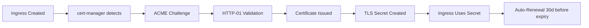

# Domains & Gateway Configuration

Complete guide for DNS, ingress, and TLS certificate management on the Mosuon cluster.

## Domain Structure

### Primary Domains

```
ultimatestats.co.ke (207.180.237.35)
├── stats.ultimatestats.co.ke → Frontend (Next.js PWA)
├── api.stats.ultimatestats.co.ke → Backend API (Go/Chi)
├── argocd.ultimatestats.co.ke → ArgoCD Dashboard
├── grafana.ultimatestats.co.ke → Grafana Monitoring
├── superset.ultimatestats.co.ke → Superset Analytics
└── prometheus.ultimatestats.co.ke → Prometheus Metrics
```

### Infrastructure Services

```
*.ultimatestats.co.ke
├── postgresql.infra (internal only)
├── redis-master.infra (internal only)
├── rabbitmq.infra (internal only)
├── nats.messaging (internal only)
└── ollama.infra (internal only)
```

## DNS Configuration

### A Records (Required)

Point all subdomains to the cluster IP:

```dns
; Primary domain
ultimatestats.co.ke.              A    207.180.237.35

; Application domains
stats.ultimatestats.co.ke.        A    207.180.237.35
api.stats.ultimatestats.co.ke.    A    207.180.237.35

; Infrastructure domains
argocd.ultimatestats.co.ke.       A    207.180.237.35
grafana.ultimatestats.co.ke.      A    207.180.237.35
superset.ultimatestats.co.ke.     A    207.180.237.35
prometheus.ultimatestats.co.ke.   A    207.180.237.35
```

### Wildcard Record (Optional)

```dns
*.ultimatestats.co.ke.            A    207.180.237.35
```

**Pros**:
- Simplifies adding new services
- No need to update DNS for each new app

**Cons**:
- Less control over exposed services
- Security consideration (all subdomains resolve)

### CNAME Records (Alternative)

```dns
stats.ultimatestats.co.ke.        CNAME  @
api.stats.ultimatestats.co.ke.    CNAME  @
argocd.ultimatestats.co.ke.       CNAME  @
grafana.ultimatestats.co.ke.      CNAME  @
```

## NGINX Ingress Controller

### Installation

```bash
# Install via Helm
helm repo add ingress-nginx https://kubernetes.github.io/ingress-nginx
helm repo update

helm install ingress-nginx ingress-nginx/ingress-nginx \
  --namespace ingress-nginx \
  --create-namespace \
  --set controller.service.type=NodePort \
  --set controller.service.nodePorts.http=30080 \
  --set controller.service.nodePorts.https=30443 \
  --set controller.ingressClassResource.default=true \
  --set controller.metrics.enabled=true \
  --set controller.podAnnotations."prometheus\.io/scrape"=true \
  --set controller.podAnnotations."prometheus\.io/port"=10254
```

### Port Configuration

**NodePort Mapping**:
- HTTP: `30080` → Container `80`
- HTTPS: `30443` → Container `443`

**Firewall Rules** (on 207.180.237.35):
```bash
# Allow HTTP traffic
sudo ufw allow 30080/tcp

# Allow HTTPS traffic
sudo ufw allow 30443/tcp

# Verify rules
sudo ufw status
```

**Port Forwarding** (if behind router):
```
External 80  → 207.180.237.35:30080
External 443 → 207.180.237.35:30443
```

### IngressClass

```yaml
apiVersion: networking.k8s.io/v1
kind: IngressClass
metadata:
  name: nginx
  annotations:
    ingressclass.kubernetes.io/is-default-class: "true"
spec:
  controller: k8s.io/ingress-nginx
```

## TLS Certificate Management

### cert-manager Installation

```bash
# Install cert-manager
kubectl apply -f https://github.com/cert-manager/cert-manager/releases/download/v1.14.0/cert-manager.yaml

# Verify installation
kubectl get pods -n cert-manager
```

### ClusterIssuer (Let's Encrypt)

```yaml
apiVersion: cert-manager.io/v1
kind: ClusterIssuer
metadata:
  name: letsencrypt-prod
spec:
  acme:
    server: https://acme-v02.api.letsencrypt.org/directory
    email: admin@ultimatestats.co.ke
    privateKeySecretRef:
      name: letsencrypt-prod-key
    solvers:
    - http01:
        ingress:
          class: nginx
---
apiVersion: cert-manager.io/v1
kind: ClusterIssuer
metadata:
  name: letsencrypt-staging
spec:
  acme:
    server: https://acme-staging-v02.api.letsencrypt.org/directory
    email: admin@ultimatestats.co.ke
    privateKeySecretRef:
      name: letsencrypt-staging-key
    solvers:
    - http01:
        ingress:
          class: nginx
```

### Certificate Lifecycle



### Certificate Troubleshooting

```bash
# Check certificate status
kubectl get certificate -A

# Describe certificate for details
kubectl describe certificate game-stats-ui-tls -n mosuon

# Check certificate request
kubectl get certificaterequest -A

# View cert-manager logs
kubectl logs -n cert-manager -l app=cert-manager

# Force renewal
kubectl delete certificate game-stats-ui-tls -n mosuon
# cert-manager will recreate automatically
```

## Ingress Resource Examples

### Frontend Application

```yaml
apiVersion: networking.k8s.io/v1
kind: Ingress
metadata:
  name: game-stats-ui
  namespace: mosuon
  annotations:
    cert-manager.io/cluster-issuer: letsencrypt-prod
    nginx.ingress.kubernetes.io/ssl-redirect: "true"
    nginx.ingress.kubernetes.io/force-ssl-redirect: "true"
    nginx.ingress.kubernetes.io/proxy-body-size: "10m"
spec:
  ingressClassName: nginx
  tls:
    - hosts:
        - stats.ultimatestats.co.ke
      secretName: game-stats-ui-tls
  rules:
    - host: stats.ultimatestats.co.ke
      http:
        paths:
          - path: /
            pathType: Prefix
            backend:
              service:
                name: game-stats-ui
                port:
                  number: 3000
```

### Backend API

```yaml
apiVersion: networking.k8s.io/v1
kind: Ingress
metadata:
  name: game-stats-api
  namespace: mosuon
  annotations:
    cert-manager.io/cluster-issuer: letsencrypt-prod
    nginx.ingress.kubernetes.io/ssl-redirect: "true"
    nginx.ingress.kubernetes.io/force-ssl-redirect: "true"
    nginx.ingress.kubernetes.io/proxy-body-size: "50m"
    nginx.ingress.kubernetes.io/proxy-read-timeout: "300"
    nginx.ingress.kubernetes.io/proxy-send-timeout: "300"
    nginx.ingress.kubernetes.io/enable-cors: "true"
    nginx.ingress.kubernetes.io/cors-allow-origin: "https://stats.ultimatestats.co.ke"
    nginx.ingress.kubernetes.io/cors-allow-methods: "GET, POST, PUT, DELETE, OPTIONS"
    nginx.ingress.kubernetes.io/cors-allow-credentials: "true"
spec:
  ingressClassName: nginx
  tls:
    - hosts:
        - api.stats.ultimatestats.co.ke
      secretName: game-stats-api-tls
  rules:
    - host: api.stats.ultimatestats.co.ke
      http:
        paths:
          - path: /
            pathType: Prefix
            backend:
              service:
                name: game-stats-api
                port:
                  number: 4000
```

### ArgoCD Dashboard

```yaml
apiVersion: networking.k8s.io/v1
kind: Ingress
metadata:
  name: argocd-server
  namespace: argocd
  annotations:
    cert-manager.io/cluster-issuer: letsencrypt-prod
    nginx.ingress.kubernetes.io/ssl-redirect: "true"
    nginx.ingress.kubernetes.io/force-ssl-redirect: "true"
    nginx.ingress.kubernetes.io/backend-protocol: "HTTPS"
    nginx.ingress.kubernetes.io/ssl-passthrough: "true"
spec:
  ingressClassName: nginx
  tls:
    - hosts:
        - argocd.ultimatestats.co.ke
      secretName: argocd-tls
  rules:
    - host: argocd.ultimatestats.co.ke
      http:
        paths:
          - path: /
            pathType: Prefix
            backend:
              service:
                name: argocd-server
                port:
                  number: 443
```

## Advanced Ingress Annotations

### Rate Limiting

```yaml
metadata:
  annotations:
    nginx.ingress.kubernetes.io/rate-limit: "100"
    nginx.ingress.kubernetes.io/limit-rps: "10"
    nginx.ingress.kubernetes.io/limit-connections: "50"
```

### Request Buffering

```yaml
metadata:
  annotations:
    nginx.ingress.kubernetes.io/proxy-buffering: "on"
    nginx.ingress.kubernetes.io/proxy-buffer-size: "8k"
    nginx.ingress.kubernetes.io/proxy-buffers-number: "4"
```

### WebSocket Support

```yaml
metadata:
  annotations:
    nginx.ingress.kubernetes.io/websocket-services: "game-stats-api"
    nginx.ingress.kubernetes.io/proxy-read-timeout: "3600"
    nginx.ingress.kubernetes.io/proxy-send-timeout: "3600"
```

### Custom Headers

```yaml
metadata:
  annotations:
    nginx.ingress.kubernetes.io/configuration-snippet: |
      more_set_headers "X-Frame-Options: DENY";
      more_set_headers "X-Content-Type-Options: nosniff";
      more_set_headers "X-XSS-Protection: 1; mode=block";
      more_set_headers "Referrer-Policy: strict-origin-when-cross-origin";
```

## Load Balancer Strategy

### NodePort (Current Setup)

**Advantages**:
- Simple, no external dependencies
- Works on bare metal VPS
- Predictable port numbers

**Disadvantages**:
- Requires port forwarding (80/443 → 30080/30443)
- No automatic failover

**Configuration**:
```bash
# iptables redirect (on VPS)
sudo iptables -t nat -A PREROUTING -p tcp --dport 80 -j REDIRECT --to-port 30080
sudo iptables -t nat -A PREROUTING -p tcp --dport 443 -j REDIRECT --to-port 30443

# Make persistent
sudo apt install iptables-persistent
sudo netfilter-persistent save
```

### LoadBalancer (Cloud Alternative)

If migrating to cloud (GKE, EKS, AKS):

```yaml
apiVersion: v1
kind: Service
metadata:
  name: ingress-nginx-controller
  namespace: ingress-nginx
spec:
  type: LoadBalancer
  externalTrafficPolicy: Local
  ports:
    - name: http
      port: 80
      targetPort: http
    - name: https
      port: 443
      targetPort: https
```

## DNS Providers

### Cloudflare Setup

```bash
# Add A records via API
curl -X POST "https://api.cloudflare.com/client/v4/zones/ZONE_ID/dns_records" \
  -H "Authorization: Bearer YOUR_API_TOKEN" \
  -H "Content-Type: application/json" \
  --data '{
    "type": "A",
    "name": "stats.ultimatestats.co.ke",
    "content": "207.180.237.35",
    "ttl": 120,
    "proxied": false
  }'
```

**Cloudflare Proxy**:
- Orange cloud (proxied): DDoS protection, CDN
- Grey cloud (DNS only): Direct to origin

**Recommendation**: Use proxied mode for public-facing apps, DNS-only for ArgoCD/internal tools.

### Route53 Setup (AWS)

```bash
# Create hosted zone
aws route53 create-hosted-zone \
  --name ultimatestats.co.ke \
  --caller-reference "$(date +%s)"

# Add A record
aws route53 change-resource-record-sets \
  --hosted-zone-id Z123456789 \
  --change-batch '{
    "Changes": [{
      "Action": "CREATE",
      "ResourceRecordSet": {
        "Name": "stats.ultimatestats.co.ke",
        "Type": "A",
        "TTL": 300,
        "ResourceRecords": [{"Value": "207.180.237.35"}]
      }
    }]
  }'
```

## Health Checks

### Ingress Health

```bash
# Check ingress controller status
kubectl get pods -n ingress-nginx

# Check ingress resources
kubectl get ingress -A

# Test HTTP redirect
curl -I http://stats.ultimatestats.co.ke

# Test HTTPS
curl -I https://stats.ultimatestats.co.ke

# Test with specific host header (before DNS)
curl -H "Host: stats.ultimatestats.co.ke" http://207.180.237.35:30080
```

### Certificate Validation

```bash
# Check certificate expiry
openssl s_client -connect stats.ultimatestats.co.ke:443 -servername stats.ultimatestats.co.ke | openssl x509 -noout -dates

# Verify certificate chain
openssl s_client -connect stats.ultimatestats.co.ke:443 -servername stats.ultimatestats.co.ke -showcerts

# Check SSL Labs rating
# Visit: https://www.ssllabs.com/ssltest/analyze.html?d=stats.ultimatestats.co.ke
```

## Monitoring & Metrics

### Ingress Metrics

```bash
# Prometheus metrics endpoint
curl http://207.180.237.35:30080/metrics

# Key metrics:
# - nginx_ingress_controller_requests (request count)
# - nginx_ingress_controller_request_duration_seconds (latency)
# - nginx_ingress_controller_nginx_process_connections (active connections)
```

### Grafana Dashboards

Import dashboard ID: **9614** (NGINX Ingress Controller)

Key panels:
- Request Rate
- Success Rate (non-5xx)
- 95th Percentile Latency
- Active Connections

## Troubleshooting

### DNS Not Resolving

```bash
# Check DNS propagation
dig stats.ultimatestats.co.ke +short

# Check from external resolver
dig @8.8.8.8 stats.ultimatestats.co.ke +short

# Flush local DNS cache (client)
sudo systemd-resolve --flush-caches
```

### Certificate Issues

```bash
# Check certificate secret
kubectl get secret game-stats-ui-tls -n mosuon -o yaml

# Check certificate order
kubectl describe certificaterequest -n mosuon

# View ACME challenge
kubectl get challenges -A

# Manually verify challenge
curl http://stats.ultimatestats.co.ke/.well-known/acme-challenge/TOKEN
```

### 502 Bad Gateway

```bash
# Check backend pod status
kubectl get pods -n mosuon -l app=game-stats-ui

# Check service endpoints
kubectl get endpoints -n mosuon game-stats-ui

# Check ingress logs
kubectl logs -n ingress-nginx -l app.kubernetes.io/component=controller
```

### 504 Gateway Timeout

```yaml
# Increase timeout annotations
metadata:
  annotations:
    nginx.ingress.kubernetes.io/proxy-connect-timeout: "300"
    nginx.ingress.kubernetes.io/proxy-send-timeout: "300"
    nginx.ingress.kubernetes.io/proxy-read-timeout: "300"
```

## Security Best Practices

1. **Always use HTTPS**: Force SSL redirect
2. **Set security headers**: X-Frame-Options, CSP, etc.
3. **Rate limiting**: Prevent abuse
4. **WAF rules**: Block malicious requests
5. **IP whitelisting**: For admin/internal tools
6. **Certificate pinning**: For mobile apps
7. **Regular audits**: Monitor access logs

## Cost Optimization

- Use wildcard certificates (reduces certificate count)
- Enable HTTP/2 (better performance)
- Configure caching headers
- Use CDN for static assets (Cloudflare)
- Monitor bandwidth usage

## Future Enhancements

- [ ] External DNS (automatic DNS record creation)
- [ ] Service Mesh (Istio/Linkerd for advanced routing)
- [ ] Multi-cluster ingress (for HA)
- [ ] gRPC ingress support
- [ ] OAuth2 proxy for authentication layer
