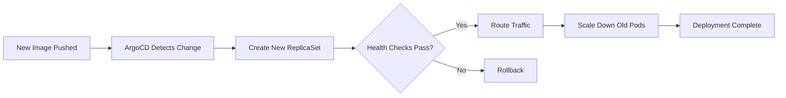

# Health Checks & Rolling Updates

Comprehensive guide for implementing health checks, readiness probes, and zero-downtime deployments.

## Health Check Types

### 1. Liveness Probe

**Purpose**: Detect if container is alive
**Action on Failure**: Restart container

```yaml
livenessProbe:
  httpGet:
    path: /health
    port: 4000
    scheme: HTTP
  initialDelaySeconds: 30
  periodSeconds: 10
  timeoutSeconds: 3
  successThreshold: 1
  failureThreshold: 3
```

### 2. Readiness Probe

**Purpose**: Determine if container is ready to receive traffic
**Action on Failure**: Remove from service endpoints

```yaml
readinessProbe:
  httpGet:
    path: /ready
    port: 4000
    scheme: HTTP
  initialDelaySeconds: 5
  periodSeconds: 5
  timeoutSeconds: 2
  successThreshold: 1
  failureThreshold: 3
```

### 3. Startup Probe

**Purpose**: Check if application has started (for slow-starting apps)
**Action on Failure**: Restart container

```yaml
startupProbe:
  httpGet:
    path: /startup
    port: 4000
  initialDelaySeconds: 0
  periodSeconds: 10
  timeoutSeconds: 3
  successThreshold: 1
  failureThreshold: 30  # 5 minutes max startup time
```

## Probe Mechanisms

### HTTP GET

Best for: Web applications, APIs

```yaml
readinessProbe:
  httpGet:
    path: /api/health
    port: 3000
    httpHeaders:
    - name: X-Health-Check
      value: "true"
```

### TCP Socket

Best for: Databases, message queues

```yaml
livenessProbe:
  tcpSocket:
    port: 5432
  initialDelaySeconds: 15
  periodSeconds: 20
```

### Exec Command

Best for: Custom health checks

```yaml
livenessProbe:
  exec:
    command:
    - /bin/sh
    - -c
    - pg_isready -U postgres
  initialDelaySeconds: 30
  periodSeconds: 10
```

### gRPC

Best for: gRPC services

```yaml
livenessProbe:
  grpc:
    port: 9090
    service: liveness
  initialDelaySeconds: 10
```

## Health Check Implementation

### Go/Chi Backend

```go
// cmd/api/main.go
package main

import (
    "net/http"
    "github.com/go-chi/chi/v5"
)

type HealthResponse struct {
    Status    string            `json:"status"`
    Timestamp string            `json:"timestamp"`
    Checks    map[string]string `json:"checks"`
}

func healthHandler(w http.ResponseWriter, r *http.Request) {
    checks := make(map[string]string)
    
    // Check database connectivity
    if err := db.Ping(r.Context()); err != nil {
        checks["database"] = "unhealthy: " + err.Error()
        respondJSON(w, http.StatusServiceUnavailable, HealthResponse{
            Status:    "unhealthy",
            Timestamp: time.Now().Format(time.RFC3339),
            Checks:    checks,
        })
        return
    }
    checks["database"] = "healthy"
    
    // Check Redis connectivity
    if err := rdb.Ping(r.Context()).Err(); err != nil {
        checks["redis"] = "unhealthy: " + err.Error()
        respondJSON(w, http.StatusServiceUnavailable, HealthResponse{
            Status:    "unhealthy",
            Timestamp: time.Now().Format(time.RFC3339),
            Checks:    checks,
        })
        return
    }
    checks["redis"] = "healthy"
    
    respondJSON(w, http.StatusOK, HealthResponse{
        Status:    "healthy",
        Timestamp: time.Now().Format(time.RFC3339),
        Checks:    checks,
    })
}

func readyHandler(w http.ResponseWriter, r *http.Request) {
    // Lighter check for readiness
    if !appReady {
        http.Error(w, "Application not ready", http.StatusServiceUnavailable)
        return
    }
    w.WriteHeader(http.StatusOK)
    w.Write([]byte("OK"))
}

func main() {
    r := chi.NewRouter()
    r.Get("/health", healthHandler)
    r.Get("/ready", readyHandler)
    r.Get("/startup", readyHandler)  // Can be same as readiness
    
    http.ListenAndServe(":4000", r)
}
```

### Next.js Frontend

```typescript
// pages/api/health.ts
import type { NextApiRequest, NextApiResponse } from 'next';

interface HealthCheck {
  status: 'healthy' | 'unhealthy';
  timestamp: string;
  checks: Record<string, string>;
}

export default async function handler(
  req: NextApiRequest,
  res: NextApiResponse<HealthCheck>
) {
  const checks: Record<string, string> = {};

  // Check API backend connectivity
  try {
    const apiUrl = process.env.NEXT_PUBLIC_API_URL || 'http://localhost:4000';
    const response = await fetch(`${apiUrl}/health`, {
      signal: AbortSignal.timeout(2000),
    });
    
    if (response.ok) {
      checks.api = 'healthy';
    } else {
      checks.api = `unhealthy: ${response.status}`;
      return res.status(503).json({
        status: 'unhealthy',
        timestamp: new Date().toISOString(),
        checks,
      });
    }
  } catch (error) {
    checks.api = `unhealthy: ${error.message}`;
    return res.status(503).json({
      status: 'unhealthy',
      timestamp: new Date().toISOString(),
      checks,
    });
  }

  // All checks passed
  res.status(200).json({
    status: 'healthy',
    timestamp: new Date().toISOString(),
    checks,
  });
}
```

## Rolling Update Strategy

### Basic Rolling Update

```yaml
spec:
  replicas: 3
  strategy:
    type: RollingUpdate
    rollingUpdate:
      maxSurge: 1        # Max 1 extra pod during update
      maxUnavailable: 0  # Always maintain 3 pods
```

**Timeline**:
```
Initial:     [Pod1] [Pod2] [Pod3]
Step 1:      [Pod1] [Pod2] [Pod3] [Pod4-new]  # Surge
Step 2:      [Pod1] [Pod2] [Pod4-new]         # Pod3 terminated
Step 3:      [Pod1] [Pod2] [Pod4-new] [Pod5-new]
Step 4:      [Pod1] [Pod5-new] [Pod4-new]
Step 5:      [Pod1] [Pod5-new] [Pod4-new] [Pod6-new]
Final:       [Pod4-new] [Pod5-new] [Pod6-new]
```

### Aggressive Rolling Update

```yaml
strategy:
  type: RollingUpdate
  rollingUpdate:
    maxSurge: 50%       # 50% extra pods
    maxUnavailable: 25% # 25% can be down
```

**Use Case**: Faster deployments with adequate resources

### Conservative Rolling Update

```yaml
strategy:
  type: RollingUpdate
  rollingUpdate:
    maxSurge: 1
    maxUnavailable: 0
```

**Use Case**: Critical services, zero downtime required

## Deployment Lifecycle



### Progressive Delivery

```yaml
# Deployment with progressive rollout
apiVersion: apps/v1
kind: Deployment
metadata:
  name: game-stats-api
spec:
  replicas: 10
  strategy:
    type: RollingUpdate
    rollingUpdate:
      maxSurge: 1
      maxUnavailable: 0
  minReadySeconds: 30  # Wait 30s before considering pod ready
  progressDeadlineSeconds: 600  # Fail deployment if not complete in 10min
```

## Pre-Stop and Post-Start Hooks

### Pre-Stop Hook (Graceful Shutdown)

```yaml
lifecycle:
  preStop:
    exec:
      command:
      - /bin/sh
      - -c
      - |
        # Drain connections gracefully
        sleep 10
        # Notify load balancer (if applicable)
        curl -X POST http://localhost:4000/admin/shutdown
```

**Go Implementation**:
```go
func main() {
    srv := &http.Server{Addr: ":4000", Handler: r}
    
    go func() {
        if err := srv.ListenAndServe(); err != nil && err != http.ErrServerClosed {
            log.Fatalf("Server error: %v", err)
        }
    }()
    
    // Graceful shutdown
    quit := make(chan os.Signal, 1)
    signal.Notify(quit, syscall.SIGINT, syscall.SIGTERM)
    <-quit
    
    log.Println("Shutting down server...")
    
    ctx, cancel := context.WithTimeout(context.Background(), 30*time.Second)
    defer cancel()
    
    if err := srv.Shutdown(ctx); err != nil {
        log.Fatalf("Server forced to shutdown: %v", err)
    }
    
    log.Println("Server exited")
}
```

### Post-Start Hook (Initialization)

```yaml
lifecycle:
  postStart:
    exec:
      command:
      - /bin/sh
      - -c
      - |
        # Wait for app to fully initialize
        until curl -f http://localhost:4000/health; do
          echo "Waiting for app..."
          sleep 2
        done
        # Warm up cache
        curl -X POST http://localhost:4000/admin/warmup
```

## Pod Disruption Budgets

Ensure minimum availability during voluntary disruptions (node drains, updates):

```yaml
apiVersion: policy/v1
kind: PodDisruptionBudget
metadata:
  name: game-stats-api-pdb
  namespace: mosuon
spec:
  minAvailable: 2  # At least 2 pods must be available
  selector:
    matchLabels:
      app: game-stats-api
```

**Alternative**:
```yaml
spec:
  maxUnavailable: 1  # Max 1 pod can be unavailable
```

## Monitoring Rolling Updates

### Check Deployment Status

```bash
# Watch deployment progress
kubectl rollout status deployment/game-stats-api -n mosuon

# View rollout history
kubectl rollout history deployment/game-stats-api -n mosuon

# View specific revision
kubectl rollout history deployment/game-stats-api -n mosuon --revision=3

# Check ReplicaSets
kubectl get rs -n mosuon -l app=game-stats-api
```

### Monitor During Rollout

```bash
# Watch pods in real-time
watch -n 2 'kubectl get pods -n mosuon -l app=game-stats-api'

# Monitor events
kubectl get events -n mosuon --watch --field-selector involvedObject.name=game-stats-api

# Check pod readiness
kubectl get pods -n mosuon -l app=game-stats-api \
  -o jsonpath='{range .items[*]}{.metadata.name}{"\t"}{.status.phase}{"\t"}{.status.conditions[?(@.type=="Ready")].status}{"\n"}{end}'
```

## Rollback Procedures

### Automatic Rollback

ArgoCD automatically rolls back if sync fails. Manual rollback:

```bash
# Rollback to previous version
kubectl rollout undo deployment/game-stats-api -n mosuon

# Rollback to specific revision
kubectl rollout undo deployment/game-stats-api -n mosuon --to-revision=2

# Pause rollout (emergency)
kubectl rollout pause deployment/game-stats-api -n mosuon

# Resume rollout
kubectl rollout resume deployment/game-stats-api -n mosuon
```

### GitOps Rollback

```bash
# Revert Git commit
cd mosuon-devops-k8s
git revert HEAD
git push origin main

# ArgoCD detects change and syncs automatically
```

## Health Check Best Practices

1. **Separate Health and Readiness**
   - Health: Is the application alive?
   - Readiness: Can it handle traffic?

2. **Lightweight Checks**
   - Keep checks fast (< 1s)
   - Don't perform expensive operations

3. **Dependency Checks**
   - Health: Check critical dependencies (database)
   - Readiness: Check all dependencies (cache, external APIs)

4. **Appropriate Timeouts**
   ```yaml
   initialDelaySeconds: 30  # App startup time
   periodSeconds: 10        # Check every 10s
   timeoutSeconds: 3        # Fail after 3s
   failureThreshold: 3      # 3 failures = unhealthy
   ```

5. **Gradual Traffic Increase**
   ```yaml
   minReadySeconds: 30  # Wait 30s before routing traffic
   ```

## Common Health Check Patterns

### Database-Dependent Service

```yaml
livenessProbe:
  httpGet:
    path: /health/live
    port: 4000
  initialDelaySeconds: 60  # Allow DB migration time
  periodSeconds: 20
  
readinessProbe:
  httpGet:
    path: /health/ready
    port: 4000
  initialDelaySeconds: 10
  periodSeconds: 5
  failureThreshold: 2  # Quickly remove from pool if DB issues
```

### Queue Worker (No HTTP Server)

```yaml
livenessProbe:
  exec:
    command:
    - /bin/sh
    - -c
    - ps aux | grep worker | grep -v grep
  initialDelaySeconds: 10
  periodSeconds: 30
```

### Slow-Starting Application (Java, .NET)

```yaml
startupProbe:
  httpGet:
    path: /health
    port: 8080
  initialDelaySeconds: 0
  periodSeconds: 10
  failureThreshold: 30  # 5 minutes to start
  
livenessProbe:
  httpGet:
    path: /health
    port: 8080
  periodSeconds: 10
  
readinessProbe:
  httpGet:
    path: /ready
    port: 8080
  periodSeconds: 5
```

## Testing Health Checks Locally

```bash
# Test health endpoint
curl http://localhost:4000/health

# Simulate Kubernetes probe
curl -f http://localhost:4000/health || echo "Health check failed"

# Test with timeout
curl --max-time 3 http://localhost:4000/health

# Test readiness
curl http://localhost:4000/ready
```

## Troubleshooting

### Pods Not Ready

```bash
# Check readiness status
kubectl get pods -n mosuon -l app=game-stats-api

# Describe pod for events
kubectl describe pod game-stats-api-xxx -n mosuon

# Check logs
kubectl logs game-stats-api-xxx -n mosuon

# Check health endpoint manually
kubectl exec -it game-stats-api-xxx -n mosuon -- curl http://localhost:4000/health
```

### CrashLoopBackOff

```bash
# View previous container logs
kubectl logs game-stats-api-xxx -n mosuon --previous

# Check liveness probe configuration
kubectl get deployment game-stats-api -n mosuon -o yaml | grep -A 10 livenessProbe

# Increase initialDelaySeconds if app needs more startup time
kubectl patch deployment game-stats-api -n mosuon --type='json' \
  -p='[{"op": "replace", "path": "/spec/template/spec/containers/0/livenessProbe/initialDelaySeconds", "value": 60}]'
```

### Deployment Stuck

```bash
# Check deployment status
kubectl describe deployment game-stats-api -n mosuon

# Check ReplicaSets
kubectl get rs -n mosuon -l app=game-stats-api

# Check pod events
kubectl get events -n mosuon --sort-by='.lastTimestamp' | grep game-stats-api

# Force rollback if needed
kubectl rollout undo deployment/game-stats-api -n mosuon
```

## Metrics & Alerting

### Prometheus Metrics

```yaml
# ServiceMonitor for health check metrics
apiVersion: monitoring.coreos.com/v1
kind: ServiceMonitor
metadata:
  name: game-stats-api
  namespace: mosuon
spec:
  selector:
    matchLabels:
      app: game-stats-api
  endpoints:
  - port: http
    path: /metrics
    interval: 30s
```

### Grafana Alerts

```yaml
# Alert if pods not ready
- alert: PodsNotReady
  expr: kube_deployment_status_replicas_unavailable{deployment="game-stats-api"} > 0
  for: 5m
  labels:
    severity: warning
  annotations:
    summary: "Pods not ready for {{ $labels.deployment }}"
    description: "{{ $value }} pods are not ready"
```

## Zero-Downtime Deployment Checklist

- [ ] Health checks implemented (`/health`, `/ready`)
- [ ] Liveness and readiness probes configured
- [ ] Rolling update strategy defined (maxSurge, maxUnavailable)
- [ ] Graceful shutdown implemented (preStop hook)
- [ ] PodDisruptionBudget created
- [ ] Multiple replicas running (>= 2)
- [ ] Resource requests/limits set
- [ ] HPA configured for auto-scaling
- [ ] Monitoring and alerts configured
- [ ] Rollback procedure documented and tested
