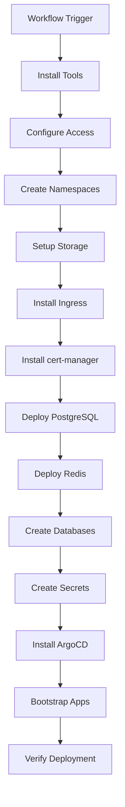

# Infrastructure Provisioning Guide

Detailed documentation for the automated infrastructure provisioning workflow.

## Overview

The provision.yml workflow automates the complete setup of the Mosuon Kubernetes cluster, from bare K3s installation to production-ready infrastructure with all services deployed.

**Workflow File**: `.github/workflows/provision.yml`
**Trigger**: Manual workflow dispatch
**Duration**: ~15-20 minutes
**Target**: 207.180.237.35

## Provisioning Workflow Architecture



## Prerequisites

### GitHub Secrets Required

| Secret | Description | How to Get |
|--------|-------------|------------|
| `KUBE_CONFIG` | Base64-encoded kubeconfig | `cat ~/.kube/config \| base64 -w 0` |
| `POSTGRES_PASSWORD` | PostgreSQL master password | `openssl rand -base64 32` |
| `REGISTRY_USERNAME` | Docker Hub username | Your Docker Hub account |
| `REGISTRY_PASSWORD` | Docker Hub access token | Docker Hub → Security → Access Tokens |
| `GH_PAT` | GitHub Personal Access Token | GitHub Settings → Developer settings → PAT |
| `JWT_SECRET` | JWT signing secret | `openssl rand -base64 32` |

### Cluster Requirements

- K3s installed on 207.180.237.35
- Firewall ports open: 80, 443, 6443
- Minimum 4GB RAM, 40GB storage
- Ubuntu 22.04 LTS

## Workflow Stages

### Stage 1: DevOps Tools Installation

Installs required CLI tools for infrastructure management.

```yaml
- name: Install DevOps Tools
  run: |
    # kubectl - Kubernetes CLI
    curl -LO "https://dl.k8s.io/release/$(curl -L -s https://dl.k8s.io/release/stable.txt)/bin/linux/amd64/kubectl"
    sudo install -o root -g root -m 0755 kubectl /usr/local/bin/kubectl
    
    # helm - Package manager
    curl https://raw.githubusercontent.com/helm/helm/main/scripts/get-helm-3 | bash
    
    # yq - YAML processor
    sudo wget https://github.com/mikefarah/yq/releases/latest/download/yq_linux_amd64 -O /usr/bin/yq
    sudo chmod +x /usr/bin/yq
    
    # argocd - GitOps CLI
    curl -sSL -o argocd-linux-amd64 https://github.com/argoproj/argo-cd/releases/latest/download/argocd-linux-amd64
    sudo install -m 555 argocd-linux-amd64 /usr/local/bin/argocd
```

**Verification**:
```bash
kubectl version --client
helm version
yq --version
argocd version --client
```

### Stage 2: Kubernetes Access Configuration

Sets up kubeconfig for cluster access.

```yaml
- name: Setup Kubernetes Access
  run: |
    mkdir -p ~/.kube
    echo "${{ secrets.KUBE_CONFIG }}" | base64 -d > ~/.kube/config
    chmod 600 ~/.kube/config
    kubectl get nodes
```

**What it does**:
- Decodes base64-encoded kubeconfig
- Saves to ~/.kube/config
- Verifies cluster connectivity

### Stage 3: Namespace Creation

Creates logical partitions for different workload types.

```yaml
- name: Create Namespaces
  run: |
    kubectl create namespace infra --dry-run=client -o yaml | kubectl apply -f -
    kubectl create namespace argocd --dry-run=client -o yaml | kubectl apply -f -
    kubectl create namespace mosuon --dry-run=client -o yaml | kubectl apply -f -
```

**Namespaces**:
- `infra`: PostgreSQL, Redis, RabbitMQ, Superset, Prometheus
- `argocd`: Argo CD GitOps controller
- `mosuon`: Application workloads (game-stats-api, game-stats-ui)

### Stage 4: Registry Credentials

Creates Docker pull secrets for private registries.

```yaml
- name: Create Registry Secrets
  run: |
    for ns in infra argocd mosuon; do
      kubectl create secret docker-registry registry-credentials \
        --docker-server=docker.io \
        --docker-username=${{ secrets.REGISTRY_USERNAME }} \
        --docker-password=${{ secrets.REGISTRY_PASSWORD }} \
        --namespace=$ns \
        --dry-run=client -o yaml | kubectl apply -f -
    done
```

**Usage**:
```yaml
spec:
  imagePullSecrets:
    - name: registry-credentials
```

### Stage 5: Storage Provisioner

Installs dynamic volume provisioner for persistent storage.

```yaml
- name: Install Storage Provisioner
  run: |
    kubectl apply -f https://raw.githubusercontent.com/rancher/local-path-provisioner/v0.0.24/deploy/local-path-storage.yaml
    kubectl patch storageclass local-path -p '{"metadata": {"annotations":{"storageclass.kubernetes.io/is-default-class":"true"}}}'
```

**What it provides**:
- Automatic PVC (Persistent Volume Claim) provisioning
- Local storage on node filesystem
- Default StorageClass for all PVCs

**Verification**:
```bash
kubectl get storageclass
# NAME                   PROVISIONER             RECLAIMPOLICY
# local-path (default)   rancher.io/local-path   Delete
```

### Stage 6: NGINX Ingress Controller

Installs HTTP/HTTPS routing and load balancing.

```yaml
- name: Install NGINX Ingress
  run: |
    helm repo add ingress-nginx https://kubernetes.github.io/ingress-nginx
    helm repo update
    
    helm upgrade --install ingress-nginx ingress-nginx/ingress-nginx \
      --namespace ingress-nginx \
      --create-namespace \
      --set controller.service.type=NodePort \
      --set controller.service.nodePorts.http=30080 \
      --set controller.service.nodePorts.https=30443
```

**Configuration**:
- Type: NodePort (for VPS without LoadBalancer)
- HTTP Port: 30080
- HTTPS Port: 30443

**Port Forwarding** (on VPS firewall):
```bash
# Route external 80 → 30080
iptables -t nat -A PREROUTING -p tcp --dport 80 -j REDIRECT --to-port 30080

# Route external 443 → 30443
iptables -t nat -A PREROUTING -p tcp --dport 443 -j REDIRECT --to-port 30443

# Save rules
netfilter-persistent save
```

### Stage 7: cert-manager

Installs automatic TLS certificate management.

```yaml
- name: Install cert-manager
  run: |
    kubectl apply -f https://github.com/cert-manager/cert-manager/releases/download/v1.13.0/cert-manager.yaml
    
    # Wait for cert-manager to be ready
    kubectl wait --for=condition=available --timeout=300s \
      deployment/cert-manager -n cert-manager
    
    # Create Let's Encrypt issuer
    kubectl apply -f - <<EOF
    apiVersion: cert-manager.io/v1
    kind: ClusterIssuer
    metadata:
      name: letsencrypt-prod
    spec:
      acme:
        server: https://acme-v02.api.letsencrypt.org/directory
        email: admin@ultimatestats.co.ke
        privateKeySecretRef:
          name: letsencrypt-prod
        solvers:
        - http01:
            ingress:
              class: nginx
    EOF
```

**What it provides**:
- Automatic TLS certificate issuance
- Let's Encrypt integration
- Certificate renewal (every 60 days)

**Usage in Ingress**:
```yaml
annotations:
  cert-manager.io/cluster-issuer: letsencrypt-prod
tls:
  - secretName: app-tls
    hosts:
      - app.ultimatestats.co.ke
```

### Stage 8: PostgreSQL Database

Deploys PostgreSQL with persistent storage.

```yaml
- name: Deploy PostgreSQL
  run: |
    helm repo add bitnami https://charts.bitnami.com/bitnami
    helm repo update
    
    helm upgrade --install postgresql bitnami/postgresql \
      --namespace infra \
      --set auth.postgresPassword=${{ secrets.POSTGRES_PASSWORD }} \
      --set primary.persistence.size=20Gi \
      --set primary.resources.requests.memory=512Mi \
      --set primary.resources.requests.cpu=250m \
      --wait
```

**Configuration**:
- Version: PostgreSQL 15
- Storage: 20Gi persistent volume
- Memory: 512Mi request
- CPU: 250m request

**Access**:
```bash
# From within cluster
postgresql.infra.svc.cluster.local:5432

# Port forward for local access
kubectl port-forward -n infra svc/postgresql 5432:5432
```

### Stage 9: Redis Cache

Deploys Redis for caching and sessions.

```yaml
- name: Deploy Redis
  run: |
    helm upgrade --install redis bitnami/redis \
      --namespace infra \
      --set auth.password=${{ secrets.POSTGRES_PASSWORD }} \
      --set master.persistence.size=8Gi \
      --set master.resources.requests.memory=256Mi \
      --set master.resources.requests.cpu=100m \
      --wait
```

**Configuration**:
- Version: Redis 7
- Storage: 8Gi persistent volume
- Memory: 256Mi request
- Authentication: Enabled

**Access**:
```bash
# From within cluster
redis-master.infra.svc.cluster.local:6379

# Get password
kubectl get secret redis -n infra -o jsonpath="{.data.redis-password}" | base64 -d
```

### Stage 10: Database Creation

Creates application-specific databases and users.

```yaml
- name: Create Application Database
  run: |
    kubectl exec -n infra postgresql-0 -- psql -U postgres <<'EOF'
    DO $$
    BEGIN
      IF NOT EXISTS (SELECT 1 FROM pg_database WHERE datname = 'game_stats') THEN
        CREATE DATABASE game_stats;
      END IF;
    END $$;
    
    DO $$
    BEGIN
      IF NOT EXISTS (SELECT 1 FROM pg_roles WHERE rolname = 'game_stats_user') THEN
        CREATE USER game_stats_user WITH PASSWORD '${{ secrets.POSTGRES_PASSWORD }}';
      END IF;
    END $$;
    
    GRANT ALL PRIVILEGES ON DATABASE game_stats TO game_stats_user;
    \c game_stats
    GRANT ALL ON SCHEMA public TO game_stats_user;
    ALTER DEFAULT PRIVILEGES IN SCHEMA public GRANT ALL ON TABLES TO game_stats_user;
    EOF
```

**Idempotency**: Uses `IF NOT EXISTS` to allow re-running workflow.

**Databases Created**:
- `game_stats` - Game statistics application

**Users Created**:
- `game_stats_user` - Application database user

### Stage 11: Application Secrets

Creates Kubernetes secrets with connection strings and credentials.

```yaml
- name: Create Application Secrets
  run: |
    kubectl create secret generic game-stats-api-secrets \
      --from-literal=DATABASE_URL="postgresql://game_stats_user:${{ secrets.POSTGRES_PASSWORD }}@postgresql.infra:5432/game_stats" \
      --from-literal=REDIS_PASSWORD="${{ secrets.POSTGRES_PASSWORD }}" \
      --from-literal=JWT_SECRET="${{ secrets.JWT_SECRET }}" \
      --namespace=mosuon \
      --dry-run=client -o yaml | kubectl apply -f -
```

**Secrets**:
- `DATABASE_URL`: PostgreSQL connection string
- `REDIS_PASSWORD`: Redis authentication password
- `JWT_SECRET`: JWT token signing key

**Usage in Deployment**:
```yaml
env:
  - name: DATABASE_URL
    valueFrom:
      secretKeyRef:
        name: game-stats-api-secrets
        key: DATABASE_URL
```

### Stage 12: Argo CD Installation

Installs GitOps continuous deployment controller.

```yaml
- name: Install Argo CD
  run: |
    kubectl create namespace argocd --dry-run=client -o yaml | kubectl apply -f -
    kubectl apply -n argocd -f https://raw.githubusercontent.com/argoproj/argo-cd/stable/manifests/install.yaml
    
    # Wait for ArgoCD to be ready
    kubectl wait --for=condition=available --timeout=300s \
      deployment/argocd-server -n argocd
    
    # Create ingress
    kubectl apply -f - <<EOF
    apiVersion: networking.k8s.io/v1
    kind: Ingress
    metadata:
      name: argocd-server-ingress
      namespace: argocd
      annotations:
        cert-manager.io/cluster-issuer: letsencrypt-prod
        nginx.ingress.kubernetes.io/ssl-passthrough: "true"
        nginx.ingress.kubernetes.io/backend-protocol: "HTTPS"
    spec:
      ingressClassName: nginx
      tls:
      - hosts:
        - argocd.ultimatestats.co.ke
        secretName: argocd-server-tls
      rules:
      - host: argocd.ultimatestats.co.ke
        http:
          paths:
          - path: /
            pathType: Prefix
            backend:
              service:
                name: argocd-server
                port:
                  number: 443
    EOF
```

**Access**:
```bash
# Get admin password
kubectl -n argocd get secret argocd-initial-admin-secret \
  -o jsonpath="{.data.password}" | base64 -d

# URL
https://argocd.ultimatestats.co.ke
```

### Stage 13: Bootstrap Applications

Deploys application definitions for ArgoCD to manage.

```yaml
- name: Bootstrap ArgoCD Applications
  run: |
    # Apply root app (app-of-apps pattern)
    kubectl apply -f apps/root-app.yaml
    
    # Apply individual apps
    kubectl apply -f apps/game-stats-api/app.yaml
    kubectl apply -f apps/game-stats-ui/app.yaml
    
    # Wait for apps to sync
    argocd app wait root-app --sync
    argocd app wait game-stats-api --sync
    argocd app wait game-stats-ui --sync
```

**App-of-Apps Pattern**:
- `root-app` manages all child applications
- Automatically detects new apps in `apps/` directory
- Single sync point for entire platform

## Post-Provisioning Verification

### Check All Pods Running

```bash
kubectl get pods -A

# Expected:
# NAMESPACE      NAME                              READY   STATUS
# infra          postgresql-0                      1/1     Running
# infra          redis-master-0                    1/1     Running
# argocd         argocd-server-xxx                 1/1     Running
# argocd         argocd-repo-server-xxx            1/1     Running
# argocd         argocd-application-controller-xxx 1/1     Running
# mosuon         game-stats-api-xxx                1/1     Running
# mosuon         game-stats-ui-xxx                 1/1     Running
```

### Verify Ingress Configuration

```bash
kubectl get ingress -A

# Expected:
# NAMESPACE   NAME                    HOSTS                          PORTS
# argocd      argocd-server-ingress   argocd.ultimatestats.co.ke     80, 443
# mosuon      game-stats-api          api.stats.ultimatestats.co.ke  80, 443
# mosuon      game-stats-ui           stats.ultimatestats.co.ke      80, 443
```

### Check TLS Certificates

```bash
kubectl get certificate -A

# All should show READY=True
```

### Test Endpoints

```bash
# API health check
curl https://api.stats.ultimatestats.co.ke/health

# UI
curl -I https://stats.ultimatestats.co.ke

# ArgoCD
curl -I https://argocd.ultimatestats.co.ke
```

## Re-running Provisioning

The workflow is idempotent and can be re-run safely:

```bash
gh workflow run provision.yml
```

**Idempotent operations**:
- Namespace creation (dry-run=client)
- Secret creation (dry-run=client)
- Helm upgrades (--install flag)
- Database creation (IF NOT EXISTS)

## Cleanup / Destroy

To completely remove infrastructure:

```bash
# Delete all applications
kubectl delete -f apps/

# Uninstall Helm releases
helm uninstall postgresql -n infra
helm uninstall redis -n infra
helm uninstall ingress-nginx -n ingress-nginx

# Delete ArgoCD
kubectl delete -n argocd -f https://raw.githubusercontent.com/argoproj/argo-cd/stable/manifests/install.yaml

# Delete namespaces (this deletes all resources)
kubectl delete namespace infra
kubectl delete namespace argocd
kubectl delete namespace mosuon
```

## Troubleshooting

### Workflow Fails at Tool Installation

```bash
# GitHub Actions runner may have network issues
# Retry the workflow or use alternative mirrors
```

### Cannot Connect to Cluster

```bash
# Verify KUBE_CONFIG secret is correct
echo "$KUBE_CONFIG" | base64 -d | kubectl --kubeconfig=- get nodes

# Check VPS firewall allows port 6443
```

### PostgreSQL Won't Start

```bash
# Check logs
kubectl logs -n infra postgresql-0

# Common: Insufficient resources
kubectl describe pod postgresql-0 -n infra
```

### Certificate Not Issuing

```bash
# Check DNS is pointing to correct IP
nslookup api.stats.ultimatestats.co.ke

# Check cert-manager logs
kubectl logs -n cert-manager -l app=cert-manager

# Describe certificate
kubectl describe certificate game-stats-api-tls -n mosuon
```

## Monitoring Provisioning

### GitHub Actions UI

View real-time logs at:
```
https://github.com/Bengo-Hub/mosuon-devops-k8s/actions/workflows/provision.yml
```

### CLI Monitoring

```bash
# Watch workflow
gh run watch

# List runs
gh run list --workflow=provision.yml

# View logs
gh run view --log
```

## Next Steps

After successful provisioning:

1. **Deploy Applications**: Run build.sh for each app
2. **Configure Monitoring**: Setup Prometheus/Grafana dashboards
3. **Setup Backups**: Configure automated PostgreSQL backups
4. **Security Hardening**: Enable network policies, rotate secrets
5. **Documentation**: Update team wikis with access details

## Related Documentation

- [Cluster Setup Workflow](CLUSTER-SETUP-WORKFLOW.md)
- [Access Setup Guide](comprehensive-access-setup.md)
- [Operations Runbook](OPERATIONS-RUNBOOK.md)
